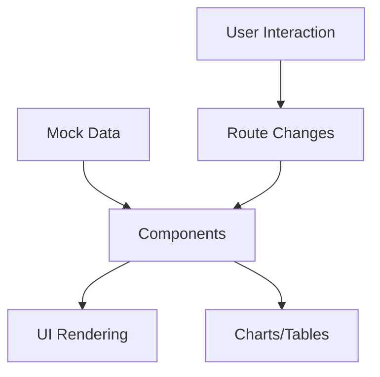

# Architecture Overview

## Core Architecture Principles

The Material Dashboard PRO is built on these key architectural principles:

1. **Component-Based Architecture**

   - Modular components for better maintainability
   - Clear separation of concerns
   - Reusable widget components

2. **Layout Structure**

   ```
   Layout
   ├── Sidebar (Navigation)
   ├── Topbar
   └── Dashboard (Content Area)
       └── Widgets
   ```

3. **Responsive Design**
   - Mobile-first approach
   - Breakpoint-based layouts
   - Collapsible sidebar for mobile
   - Stacked widgets on smaller screens

## Key Components

### Layout Components

- **Sidebar**: Main navigation component

  - Collapsible menu items
  - User profile section
  - Dynamic route handling

- **Topbar**: Application header
  - Navigation breadcrumbs
  - User actions
  - Global controls

### Dashboard Widgets

- **Cards**: Key metrics display
- **Charts**: Data visualization
  - Revenue trends
  - Sales distribution
  - Channel performance
- **Tables**: Detailed data presentation
  - Product performance
  - Regional sales

## Data Flow



## Styling Architecture

1. **Theme Provider**

   - Global color palette
   - Typography system
   - Spacing scale
   - Component defaults

2. **Styling Methods**
   - MUI's `sx` prop for component-specific styles
   - Theme customization for global styles
   - Responsive design utilities

## File Organization

```
src/
├── components/          # Reusable components
├── pages/              # Route components
├── theme/              # Theme configuration
├── mocks/              # Mock data
└── types/              # TypeScript definitions
```

## Design Decisions

1. **Material UI**

   - Comprehensive component library
   - Built-in theming system
   - Excellent TypeScript support
   - Responsive design utilities

2. **Chart Components**

   - MUI X-Charts for consistency
   - Built-in responsiveness
   - Theme integration

3. **State Management**
   - React's built-in state
   - Prop drilling minimized
   - Prepared for future scaling

## Performance Considerations

1. **Code Splitting**

   - Route-based splitting
   - Lazy-loaded components

2. **Rendering Optimization**
   - Memoized components
   - Optimized re-renders
   - Efficient data structures

## Future Architecture Considerations

1. **Scalability**

   - Prepared for state management
   - Modular component structure
   - Extensible routing system

2. **Maintenance**
   - Clear component hierarchy
   - Consistent naming conventions
   - Documentation standards
