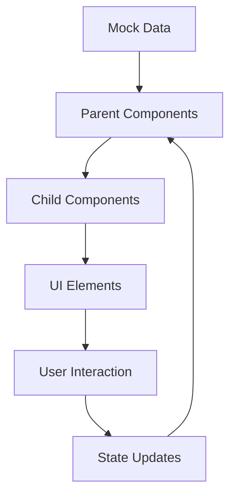

# Data Flow Documentation

## Overview

The application follows a unidirectional data flow pattern, with mock data as the current data source. This document outlines the data structure, flow, and management within the application.

## Data Sources

### Mock Data Structure

```typescript
// src/mocks/sales.ts

// Sales Cards Data
export interface SalesCardData {
  title: string;
  date: string;
  amount: string;
  percentage: string;
  percentageColor: string;
}

// Channels Data
export interface ChannelsPieChartData {
  id: number;
  value: number;
  label: string;
  color: string;
}

// Revenue Data
export interface RevenueChartData {
  month: string;
  facebookAds: number;
  googleAds: number;
}

// Sales by Age Data
export interface SalesByAgeData {
  ageGroup: string;
  value: number;
}

// Sales by Country Data
export interface SalesByCountryData {
  country: string;
  flag: string;
  sales: number;
  bounce: string;
}

// Top Selling Products Data
export interface TopSellingProductData {
  id: string;
  name: string;
  image: string;
  orders: number;
  value: number;
  adsSpent: number;
  refunds: number;
}
```

## Data Flow Patterns

### Component Data Flow



### Widget Data Flow

1. **Sales Cards**

   - Data → Card Component → Display
   - Updates on route change

2. **Charts**

   - Data → Chart Wrapper → Specific Chart Component → Render
   - Interactive elements update local state

3. **Tables**
   - Data → Table Component → Row Components → Display
   - Sorting/Filtering handled in component state

## State Management

### Current Implementation

- Local component state using React hooks
- Props for data passing
- Context for theme and layout state

### Component State Examples

```typescript
// Local State Example
const [expandedItems, setExpandedItems] = useState<string[]>([]);
const [mobileOpen, setMobileOpen] = useState(false);

// State Updates
const toggleExpand = (path: string) => {
  setExpandedItems((prev) =>
    prev.includes(path) ? prev.filter((item) => item !== path) : [...prev, path]
  );
};
```

## Data Transformation

### Chart Data Processing

```typescript
// Example of data transformation for charts
const processChartData = (data: RawData[]): ChartData[] => {
  return data.map((item) => ({
    label: item.label,
    value: calculateValue(item.raw),
    color: getColorByValue(item.value),
  }));
};
```

### Table Data Processing

```typescript
// Example of table data processing
const processTableData = (data: RawData[]): TableRow[] => {
  return data.map((item) => ({
    id: item.id,
    cells: [
      { value: item.name, type: "text" },
      { value: item.value, type: "number" },
      { value: item.status, type: "status" },
    ],
  }));
};
```

## Data Update Patterns

### Component Updates

1. **Route-based Updates**

   - Data refresh on route change
   - Clean up on unmount

2. **User Interaction Updates**

   - Immediate UI feedback
   - State updates after action completion

3. **Periodic Updates**
   - Currently not implemented
   - Prepared for future real-time updates

## Error Handling

### Data Loading Errors

```typescript
try {
  const data = await fetchData();
  setData(data);
} catch (error) {
  setError(error);
  // Error boundary handling
}
```

### Data Validation

```typescript
interface DataValidator {
  isValid: boolean;
  errors: string[];
}

const validateData = (data: unknown): DataValidator => {
  // Validation logic
};
```

## Future Improvements

1. **Real-time Updates**

   - WebSocket integration
   - Real-time data streaming
   - Update optimizations

2. **Data Caching**

   - Local storage
   - Memory caching
   - Cache invalidation

3. **State Management**

   - Consider Redux/MobX
   - Global state patterns
   - Performance optimization

4. **API Integration**
   - RESTful endpoints
   - GraphQL consideration
   - Error handling

## Best Practices

1. **Data Immutability**

   - Use immutable update patterns
   - Avoid direct state mutation
   - Leverage TypeScript readonly

2. **Type Safety**

   - Strong typing for all data
   - Runtime type checking
   - Type guards where necessary

3. **Performance**
   - Memoization
   - Lazy loading
   - Batch updates
